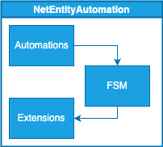
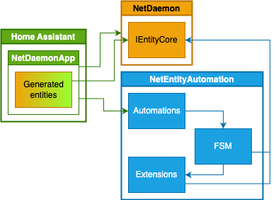

# NetEntityAutomation

Project provides several NuGet packages for home automation on open source platform Home Assistant using NetDaemon framework.

## Top level architecture

There are three main parts of the solution:
1. **Automations**
2. **FSM**
3. **Extensions**

### Automations

Automations act's like a glue between FSM and Home Assistant.
They are responsible for:
- Creating FSM instances
- Configuring FSM instances
- Providing FSM instances with required data from Home Assistant

### FSM

FSM is a Finite State Machine that is responsible for:
- Managing state of the entity
- Managing state of the entity's attributes
- Loading FSM to the latest state from JSON file if needed?

### Extensions

Extensions are methods for NetDaemon generated entities.
As there are no way to reference extension methods generated by NetDaemon, they are placed in separate project.
Extensions are responsible for:
- Providing API for calling services related to a given entity

Following diagram shows dependencies between bigger parts of the final usage:

## Automations scenarios
**TBD**

## TO BE SOLVED
- <ins>Where to put reloading from JSON after restart?</ins>
- <ins>How to detect restart of HA and typical restart of ND App?</ins>